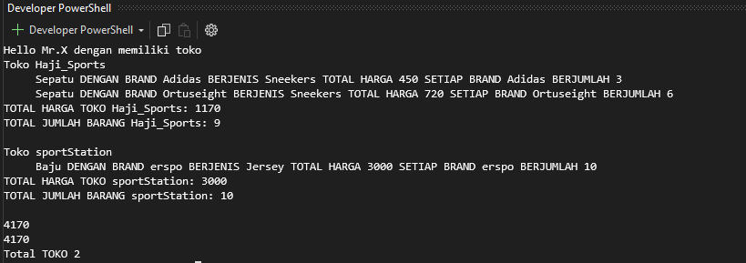

# Inventory System for Multiple Stores

This is a simple console-based inventory system built using C#. It allows you to add items (such as shoes and clothes) to multiple stores and calculates the total price and quantity of the items in each store.

## Features

- **Add items to stores**: You can add multiple items to a store, such as shoes and clothes.
- **Calculate total price and quantity**: The system calculates the total price and total quantity of the items in each store.
- **Display store inventory**: The system lists all items in each store, along with their individual prices, quantities, and types.

## Technologies Used

- C# (.NET 8 or later)
- Console Application

## How to Use

1. Clone this repository:

   ```bash
   git clone https://github.com/tkarombang/C--Beginerrs

2. Example Output:


